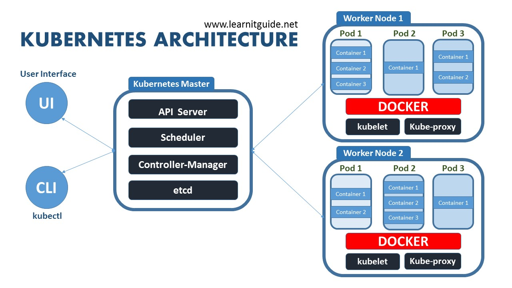

# Django Kubernetes Setup

## Software Stack
- Django: Web App
- Celery - Asynchronous task queue/job queue based on distributed message passing
- Redis: In-memory data structure project implementing a distributred, in-memory key-value DB with optional durability.
- PostgreSQL: Object-relational database management system. (RDBMS)
- Docker
- Kubernetes
- GCP: Google Cloud Platform

## Theory Knowledge



Nodes
```
Linux machines running Docker containers that make up the cluster
```

Pods
```
Basic unit of orchestration. Pod has one or more containers running inside of it.
Pods can have an arbitrary amount of Labels which are used by Services and
Replication Controllers to match with Pods.
```

Replication Controller
```
Controls how many of a given Pod exist, based on a provided label. ex. 1 or 10 of a given Pod. 
```

Service
```
Communication between Pods even if they're on different Nodes. A Service provides an IP on a virtual private network.
```

Persistent Volume
```
A PV resource is a piece of storage on the cluster analogous to a node (physical device or VM). Captures how storage is implemented.
```

Persistent Volume Claim
```
A PVC is a request for storage by the user and allows for the user to consume abstract storage resources on the cluster.
```

Job Resource
```
A Job creates a pod which runs a single task to completion.
The downsides of using the Job resource to run migrations, is that the migrations cannot be run again without modifying the manifest file i.e. by updating the image name.
IN scenario where mgirations needs to be re-run with the same image, the Job object needs to be deleted from server before it can be run again.
```


## Plan
- https://medium.com/@markgituma/kubernetes-local-to-production-with-django-1-introduction-d73adc9ce4b4
    - create simple django app in docker container and deploy in lcoal K8 cluster using minikube
    - run postgresql db running as pod in cluster
    - add redis cache and celery for async processing
- GCP setup: https://medium.com/google-cloud/deploying-django-postgres-redis-containers-to-kubernetes-9ee28e7a146
    - gcp project setup
    - redis setup
    - postgresql gcp setup
    - serve static content using CDN
    - local dev using minikube and port forwarding and hot reloading
- Autoscaling
    - run application in cloud
    - run a second server on GCP and use it with docker to constantly ping main server and test autoscaling

## Development Notes
- Using DB as a service provides features that can be hard to implement and manage well
    - managed high availability and redundancy
    - easy vertical scaling of computational resources to handle variable load
    - easy horizontal scaling by creating replicated instances to handle high traffic
    - easy snapshots and backup
    - security patches and db monitoring
- Kubernetes allows the use of the service name i.e. postgres-service for domain name resolution to the pod IP.
- run migrations via CLI
    - `kubectl exec <pod_name> -- python /app/manage.py migrate`
- delete a job run through file
    - `kubectl delete -f <path/job-migration.yaml`


## Steps

- Step 1/2
    - setup minikube kubectl
    - create base image for sample app using Docker
    - start deployment of app on minikube
    - start service of app to expose app outside of cluster
- Step 3
    - use persistent volume subsystem for postgresql and setup PVC
    - use Secret resource API to handle credentials used by PostgreSQL and Django pods
    - initialize postgresql pods to use persistent volume
    - expose db as service to allow for access within cluster
    - update django app to access db
    - run migrations using Job API and CLI
- Step 4
    - deploy redis into K8 cluster, and add a service to expose redis to django application
    - update django to use redis as message broker and as a cache
    - create celery tasks in Django app, and have deployment to process tasks for queue (celery worker) and have deployment for running periodic tasks (celery beat)
    - add celery flower package as deployment and expose it as a service to allow from from web browser
- Step 5 --> HERE
    - start setting up for deploying to GCP

